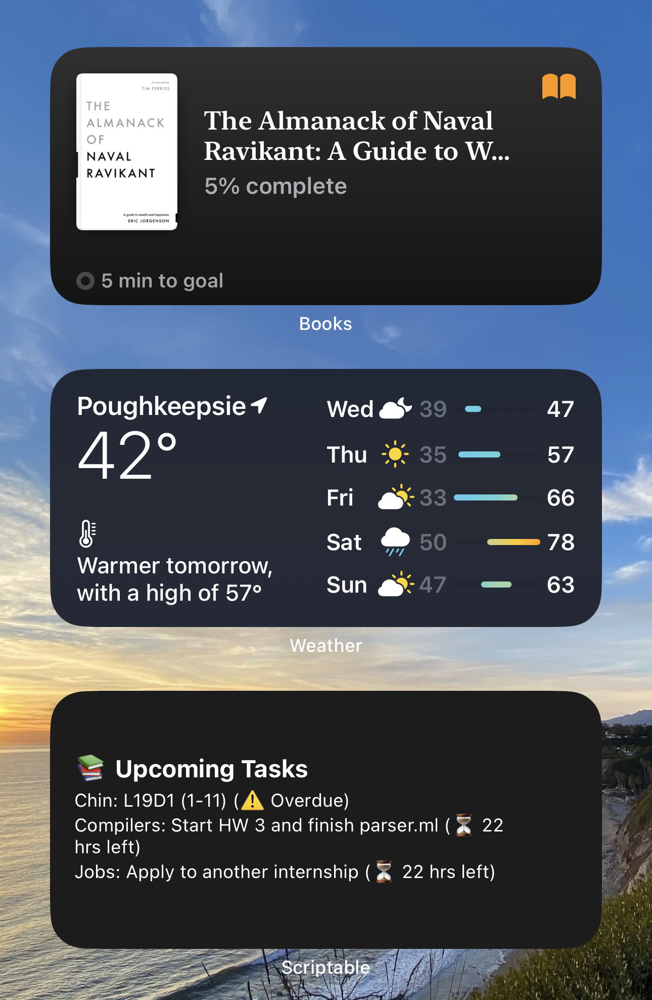

# Lightweight Scriptable Task Manager — _"Do List"_
This is a simple task manager as my first project in the iOS app Scriptable. The goal of this project was to try out what I can accomplish with widgets and the app.

# Preview

## Files Explained
### taskManager.js
You can run this script once to initalize the "tasks.json" file which will be the file that holds the database of the files that you want to keep track off.

### manageTasks.js
You can run this script to add and delete a task.

## Lessons Learned:
Scriptable for iOS: I learned how to create JavaScript scripts to access another file, display the data extracted from there and store the data.

## Optimizations:
* Want to come up with better integration into everday workflow. Understand the idea between a bigger To-Do list and this simple _"Do List"_
